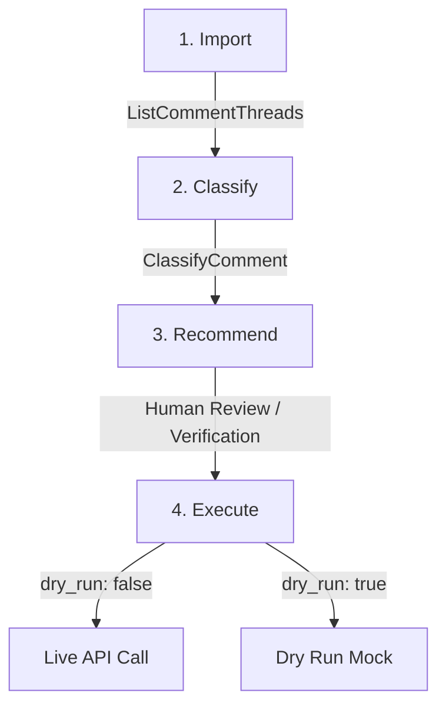

# YouTube Community Management: Safe Workflow Guide

This guide describes how to build safe, auditable, and automated community moderation workflows using the YouTube integrations in Lux.

The YouTube community management architecture enforces a strict **safe workflow boundary** that separates data ingestion and analysis from mutating API actions.

## The Safe Workflow Boundary

All mutating prisms (`ReplyToComment`, `ModerateComment`) default to a **dry-run** state. They do not execute live API calls unless explicitly configured. The recommended operational loop follows four sequential phases:



### 1. Import (Ingest)
Fetch comment threads from a video or channel using the `ListCommentThreads` lens. This is a read-only action.

### 2. Classify (Analyze)
Analyze the text displays from the ingested comments using the `ClassifyComment` prism, which runs sentiment analysis (via NLTK VADER or keyword fallback) and scans for specific edge cases (such as spam, scams, or abuse).

### 3. Recommend (Plan)
The comment is categorized into one of five states:
- `reply`: For positive comments where an auto-reply is recommended.
- `hide`: For scam links, links-only spam, or abusive comments.
- `escalate`: For bugs, platform issues, or customer support questions.
- `no-action`: For low-engagement short greetings (e.g. "ok").
- `review`: For general comments requiring manual human review.

A `recommended_reply` is generated for replies, and `reasons` are attached to the output for transparency. No mutating API action is taken during classification.

### 4. Execute (Mutate)
If the classification warrants a mutating response (e.g. `reply` or `hide`), invoke `ReplyToComment` or `ModerateComment` with `dry_run: false` to commit the action.

---

## Code Example: End-to-End Safe Loop

Below is an example illustrating the safe community management loop:

```elixir
# 1. Import comments
{:ok, %{comments: comments}} = Lux.Lenses.YouTube.ListCommentThreads.focus(%{
  video_id: "your_video_id"
})

# Process comments securely
for comment <- comments do
  # 2 & 3. Classify and Recommend
  {:ok, recommendation} = Lux.Prisms.YouTube.ClassifyComment.handler(%{
    text: comment.text_original,
    author_display_name: comment.author_display_name
  }, %{name: "CommunityManagerAgent"})

  IO.inspect(recommendation, label: "Recommendation for comment #{comment.id}")

  # 4. Execute conditionally
  case recommendation.state do
    "reply" ->
      # Safe by default! Change dry_run to false to execute live on YouTube.
      {:ok, result} = Lux.Prisms.YouTube.ReplyToComment.handler(%{
        parent_id: comment.id,
        text: recommendation.recommended_reply,
        dry_run: true # Gated default is true
      }, %{name: "CommunityManagerAgent"})
      
      IO.inspect(result, label: "Reply executed (Dry Run)")

    "hide" ->
      # Gated by dry_run: true by default
      {:ok, result} = Lux.Prisms.YouTube.ModerateComment.handler(%{
        comment_id: comment.id,
        moderation_status: "rejected",
        dry_run: true
      }, %{name: "CommunityManagerAgent"})
      
      IO.inspect(result, label: "Moderation executed (Dry Run)")

    _ ->
      # No mutate action is called for escalate, review, or no-action states
      :ok
  end
end
```

## Safety Considerations

- **Dry Run Default**: By default, `dry_run: true` is assumed. If you do not specify `dry_run` when invoking `ReplyToComment` or `ModerateComment`, the prism returns a mock response (`{:ok, %{replied: true, reply_id: "mock_reply_id"}}` or `{:ok, %{moderated: true}}`) and logs the intent rather than sending actual network traffic to Google's YouTube APIs.
- **Audit Logging**: All mutating prisms write logs detailing which agent initiated the action, the target comment ID, and the status. This provides trace logs for auditing.
